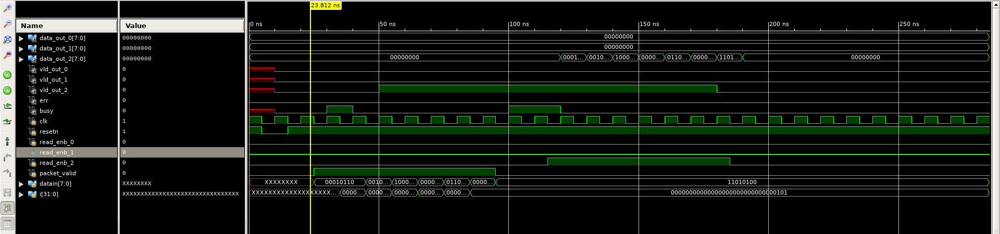
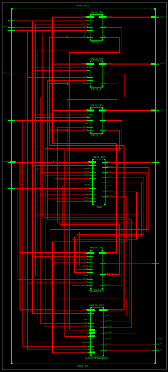

# 1x3 Packet-Based Router  

## Overview  
This project implements a **1x3 router** designed for packet-based communication, transferring data from a source LAN to one of three output ports on a **byte-by-byte basis**. The router is developed using **Verilog HDL** and verified through **Xilinx ISE** and **VC Spyglass**, with automation enabled by **TCL scripting**.  

---

## Key Features  
- **Packet Routing**: Directs incoming packets to one of three output ports based on the destination address.  
- **Packet Checking**: Ensures packet integrity during transmission for reliable data communication.  
- **Reset Functionality**: Reinitializes the system to recover from errors or start a new session.  
- **Packet Sending**: Transmits packets to the designated output ports efficiently.  
- **Packet Reading**: Reads packets sequentially from the source LAN for smooth processing.  

---

## Tools and Frameworks  
- **Xilinx ISE**: Simulation, synthesis, and implementation of the design.  

---

## Skills Utilized  
- **Verilog HDL**: Design and implementation of the router.  

---

## Screenshots  
Include screenshots of simulations, waveform outputs, RTL schematics, and Spyglass analysis results here:  

1. **Simulation Results**  
     

2. **Waveform Output**  
     

---

